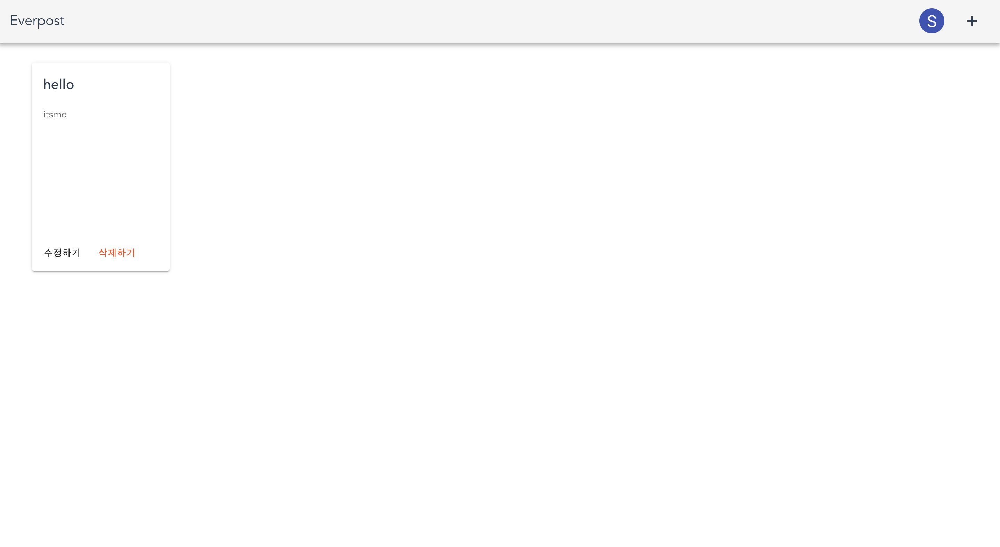

# Everpost

### 포스트잇처럼, 간단히 기록하세요

쉽고 빠르게 간단한 메모를 작성할 수 있는 Everpost 서비스의 백엔드 코드 레포지토리입니다.

[Everpost 서비스 바로가기](https://everpost-front.herokuapp.com/)

### 서비스 요약

- 사용 기술: node.js, typescript, typeorm, koa, jwt

- 배포 환경: AWS(RDS Database), Heroku(Web Server)

- 구현된 기능은 기본 CRUD 및 회원가입, 로그인 기능입니다.

- Heroku dyno(무료 요금제)에 배포를 하였기 때문에, 처음 접속시 로딩이 매우 느립니다.
